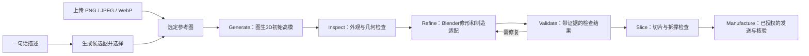

# Idea to Print · 一句话造物

从一句话或上传图片开始，制作可检查、可调整尺寸的3D模型，再衔接FDM打印。

[English](README.en.md) · [MIT License](LICENSE) · [安装与资源要求](docs/requirements.md)

这是可安装的 **3个Agent skills和配套Python工具**。由具备文件、图像和桌面工具的Agent执行流程；仓库不提供网页上传站点、通用自动雕刻引擎或无人值守打印服务。



## V1：设计、修形和制造分开验收

图像工具负责设计；Hunyuan负责初始高模；Blender与Agent负责实际修形；检查工具记录证据与未验项；Bambu Studio负责制造参数与切片；Agent衔接版本、授权和设备结果。

已实测的高模路线包括**腾讯官方网页Hunyuan3D V3.1**，需要自己的账号和可用额度。仓库自带的`hunyuan_shape.py` **仍是Hunyuan3D-2.1公共演示适配器**；没有实现计费的3.1 API客户端。网页操作能力来自Agent宿主，不能通过改服务地址把2.1脚本变成3.1 API。这里不声明3.1相对2.1的同口径提升百分比、当前价格或保证额度。

V1把验收拆为三类：

| 报告 | 解决的问题 | 必须保留的边界 |
|---|---|---|
| Fidelity（外观） | 是否像参考、姿态和细节是否正确 | 实际模型渲染与参考对比；几何闭合不能代替外观认可 |
| Geometry（几何） | 拓扑、连接、尺寸及适用的制造约束 | `PASS / FAIL / UNKNOWN`，未测到的问题不能算已通过 |
| Slice（切片） | 首层、细节成线、支撑、拆除路径和完整占板范围 | 需要实际切片和预览；树状支撑的名称不代表好拆 |

工具报告绑定具体模型和配置的SHA256。Agent修复后重新验收；不以“已修好”的文字替代结果。壁厚、细节、连接阈值按部位、喷嘴和材料配置，抽样厚度无异常不证明整个模型都合格。模型尚有未知项时可以继续修形或诊断切片，最终交付和发送必须明确实际检查范围与尚未解决的限制。

多视图可约束背面与侧面，但需要先审查同一姿态、四肢、角、花纹的一致性。保留各独立视图、角度和来源；拼图或同一图片复制多份不算多视图。已选择的设计不会因这一流程被自动重画，简单已有模型也不必重新跑一遍生成链。详见[修形与验收](skills/printable-modeling/references/refinement-and-validation.md)。

## 两种用法

在安装了技能、具备对应工具的Codex中：

> 用 $idea-to-print 做一只飘逸的狐狸，纯白，整体最长16厘米，有稳定底座，支撑好拆，先出几张图让我选。

或者直接附上图片：

> 用 $idea-to-print 把这张图片做成16厘米的可打印模型，给我看实际模型的正面和背面。

上传图已被明确选中时，会跳过概念出图和选图。照片、插画、效果图均可作为参考；单图看不到的背面仍需推断和检查。

需要打印时可以说：

> 就用这个模型打印，打印板已清空，使用白色PLA。

同一任务已经给出的授权和事实会沿用。只要求出图或建模时，流程在相应成果处结束。

## 安装

需要Python3.11或更高版本。以下命令在仓库根目录执行：

```bash
git clone https://github.com/Rjxshr1/idea-to-print.git
cd idea-to-print
python -m venv .venv
# Linux / macOS / WSL
source .venv/bin/activate
# Windows PowerShell 使用：.venv\Scripts\Activate.ps1
python -m pip install -r requirements.txt
python install.py --destination ~/.agents/skills
```

`--destination`应指向Agent实际识别的技能目录；使用其他布局的客户端可传入自己的路径，例如`~/.codex/skills`。安装器先检查全部目标，已有同名技能时会停止并保留它们。它只安装本仓库的技能和脚本；图像生成、桌面控制、Blender、Bambu Studio和账号权限由运行环境另外提供。

安装器在每个已安装技能中写入本地`runtime.local.json`，记录运行安装器的Python绝对路径。请在上面已激活的虚拟环境中运行安装器，并保留该环境。Agent在其他工作目录中使用技能时，会按实际技能目录定位脚本，使用记录的Python和绝对任务路径；不会假定当前目录就是仓库。移动或删除虚拟环境后需要更新本地运行环境记录。手动复制技能的用户需自行指定装有依赖的Python。

安装包含：

| 技能 | 作用 |
|---|---|
| `idea-to-print` | 文字/上传图片入口，选择记录，衔接各阶段 |
| `printable-modeling` | 图生3D草稿、模型检查、修复方法和毫米尺寸适配 |
| `3d-print-workflow` | 网格/切片检查、机器配置、发送前检查和结果核验 |

## 直接使用图片与命令行工具

这部分不依赖内置ImageGen。`prepare_image.py`只在本地保存文件，完全保留原图字节：

```bash
python skills/idea-to-print/scripts/prepare_image.py \
  --image /path/to/reference.png --job jobs/my-sculpture \
  --target-mm 160 --brief "Stable base and accessible removable supports"
```

输入支持静态PNG、JPEG、WebP；本地入口限制为64MiB、4000万像素。已有任务目录不被覆盖。随后可选择调用已适配的公共图生3D服务：

```bash
# 只读取当前服务的API描述
python skills/printable-modeling/scripts/hunyuan_shape.py --describe-api

# 此命令才会上传所选图片并发起生成
python skills/printable-modeling/scripts/hunyuan_shape.py \
  --job jobs/my-sculpture --input source/selected.png --attempt shape-v1
```

JPEG/WebP使用`job.json`里记录的实际输入路径。模型保存在`source/shape-shape-v1.glb`；脚本不会切片或发起打印。公共服务地址为[腾讯Hunyuan3D-2.1演示](https://huggingface.co/spaces/tencent/Hunyuan3D-2.1)，实测路线使用匿名访问、不需要API Key，但它可能排队、休眠或改变访问条件。要求图片留在本地时，不使用此适配器。

已经生成但响应解析失败时，可以恢复缓存，避免再发起一轮生成：

```bash
python skills/printable-modeling/scripts/hunyuan_shape.py \
  --job jobs/my-sculpture --attempt shape-v1 --recover
```

随后在Blender中检查真实模型的正面、侧面、背面和底部，按实际缺陷修复并导出STL。该阶段由Agent结合模型执行，**不是通用于所有图片的自动修复函数**。可选网格依赖：

```bash
python -m pip install -r requirements-modeling.txt
python skills/3d-print-workflow/scripts/print_audit.py mesh jobs/my-sculpture/outputs/model.stl
python skills/3d-print-workflow/scripts/print_audit.py fit \
  --dimensions 160 65 85 --volume 180 180 180 --clearance 10 10 5
python skills/3d-print-workflow/scripts/print_audit.py slice jobs/my-sculpture/outputs/ready.gcode.3mf
```

`print_audit.py`保留轻量拓扑、尺寸和切片包检查。V1另提供`printability_gate.py`输出带配置、范围和未知项的几何报告；`refinement_job.py`记录修订、修复说明与证据哈希。详见[检查命令与解释](skills/printable-modeling/references/refinement-and-validation.md)。这些工具不会自动雕刻模型，也不覆盖全部自交、壁厚或稳定性问题。缩放计算不代替实际切片范围检查。

## 打印机连接

Bambu Studio单独安装，配置自己的打印机、喷嘴、打印板和耗材。打印通过官方界面，桌面控制工具由Agent宿主提供；没有桌面控制时，可手动打开检查后的文件并发送。仓库里没有自动启动打印的脚本。

可选的[Bambu只读状态工具](skills/3d-print-workflow/references/bambu-lan.md)使用自己的局域网配置和本机Studio凭据；示例配置只有占位符。不要提交真实设备地址、序列号、访问码或相机画面。`jobs/`、`*.local.json`和输出文件默认被Git忽略。

另有一个处理特定Bambu切片容器的辅助工具，严格限定已验证的版本和单盘格式。详见[切片包说明](skills/3d-print-workflow/references/slice-only.md)，不要把它当成所有3MF的通用转换器。

## 验证与边界

- 这套方法曾完成概念图→图生三维→模型修复→切片→真实打印机接收/准备；不把设备接收等同于实物质量合格。
- 本仓库自动化测试使用合成图片、GLB、STL和3MF及模拟服务响应。CI不上传图片、不运行大模型、不操作打印机。
- 图片生成和3D重建服务在云端运行时，本机不需要为它们加载模型或占用推理显存。Blender/切片的内存消耗取决于模型复杂度。未测定统一最低内存，也不要求64GB。详见[资源要求](docs/requirements.md)。
- 生成效果图不等于可打印几何；单图重建可能改变背面或细节。支撑类型名称不证明好拆，最终需要实际支撑路径检查和打印反馈。

```bash
python -m pip install -r requirements-dev.txt
python -m pytest -q
```

## 许可证与贡献

本仓库原创说明、脚本、测试和参数化示例采用MIT许可证。外部模型、服务、软件和用户图片遵循各自条款，见[NOTICE](NOTICE.md)。不分发模型权重、第三方插件代码或私人的打印任务。

欢迎通过Issue报告复现步骤、工具版本和已脱敏的错误，通过Pull Request改进适配器、检查或文档。提交前运行离线测试，不要在测试中连接真实打印机。
