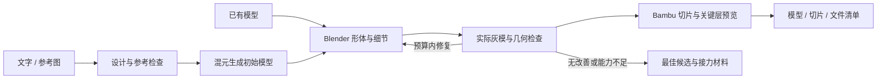

# Idea to Print · 一句话造物

从一句话、一张参考图或已有模型开始，制作可编辑的 3D 雕塑，完成造型检查、尺寸适配和打印前交付。

[English](README.en.md) · [安装与资源要求](docs/requirements.md) · [MIT License](LICENSE)

项目包含 **3 个可安装的 Agent 技能和配套 Python 工具**，串联图像生成、混元 3D、Blender 和 Bambu Studio。支持宠物、神兽等有机雕塑，也能从已有 STL/BLEND 开始处理。Agent 根据当前作业状态调用工具，保留每个版本及其检查结果。

## 功能

| 功能 | 提供什么 |
|---|---|
| 文字与图片入口 | 生成候选概念、记录设计选择，或直接导入 PNG/JPEG/WebP；保存原图及 SHA256 |
| 官方图生 3D | 腾讯混元 3.1 官方 SDK 适配器，支持主图和指定补充视角、Geometry 白模及 150 万面请求 |
| 分阶段造型 | 依次检查参考一致性、轮廓与体积、毛束/鳞片/羽片；分别记录外观和制造结果 |
| Blender 模型处理 | 保留原始高模，导出 STL、GLB、BLEND 和轻量预览；支持尺寸归一或保留原毫米坐标 |
| 有限区域修形 | 在指定区域柔化、钝化、加厚，带保护区和位移预算 |
| 实际模型预览 | 从最终 STL 渲染正面、侧面、左右斜面、背面和底面；支持脸部特写和中断续渲染 |
| 统一执行账本 | `next/status/record/reconcile/export` 管理阶段、尝试、远端任务及证据；候选、最佳和交付版本分开 |
| 有限尝试与恢复 | 默认 2 次生成、3 次局部修复、1 次参考纠正；连续无改善退出策略；已有任务继续查询或下载 |
| Bambu 切片 | 固定摆盘、快照保存机器/工艺/耗材配置，使用 Windows 离线 CLI 切片并核验结果 |
| 切片预览与交付 | 提取原始 G-code 直接预览，保存关键层截图；导出模型、切片、评价历史和统一文件清单 |

用户与 Agent 的评价分别保存，同一模型的用户否决不会被后续 Agent 评价覆盖。模型、配置或截图变更后，关联检查自动失效。结果保留 `PASS / FAIL / UNKNOWN`；达到尝试上限时，交付最佳候选及未完成项。



## 使用示例

在具备图像、建模和文件工具的 Agent 中：

> 用 $idea-to-print 做一只飘逸的狐狸，纯白，整体最长 16 厘米，有稳定底座，先出三张概念图让我选。

附上图片后：

> 用 $idea-to-print 把这张图片做成 16 厘米的雕塑，保持姿态，给我看实际模型六视图，做到打印前。

处理已有模型：

> 检查这个 STL，保持尺寸和造型，完成 A1 mini 白色 PLA 的切片预览，提供模型、切片包和未过项。

可以只完成概念、模型或打印前交付。需要实际打印时，Agent 在已有授权和设备条件满足后，通过官方打印界面执行。

## 安装

Python 3.11+，Blender 和 Bambu Studio 按需单独安装。

```bash
git clone https://github.com/Rjxshr1/idea-to-print.git
cd idea-to-print
python -m venv .venv
source .venv/bin/activate  # Windows PowerShell: .venv\Scripts\Activate.ps1
python -m pip install -r requirements.txt

# 模型处理与官方混元 API
python -m pip install -r requirements-modeling.txt -r requirements-hunyuan31.txt

python install.py --destination ~/.agents/skills
```

将 `--destination` 改为 Agent 实际使用的技能目录，例如 `~/.codex/skills`。目标已有同名技能时，安装器会停止并保留现有内容；新安装会记录当前 Python 的绝对路径。更新已有安装时，合并技能内容并保留本地配置。

| 技能 | 职责 |
|---|---|
| `idea-to-print` | 文字/图片入口、设计选择、统一账本和阶段衔接 |
| `printable-modeling` | 图生 3D、Blender 模型处理、造型检查和尺寸适配 |
| `3d-print-workflow` | 几何检查、切片、机器配置及打印流程衔接 |

图像生成与桌面控制由 Agent 宿主提供。混元官方 API 需要腾讯云凭据和可用额度；Blender 与切片在本地运行，云端图生 3D 不占用本机推理显存。

## 命令行入口

创建图片作业并查看下一步：

```bash
python skills/idea-to-print/scripts/prepare_image.py \
  --image /path/to/reference.png --job jobs/my-sculpture \
  --target-mm 160 --brief "White sculpture with a stable base"

python skills/idea-to-print/scripts/workflow_v2.py init --job jobs/my-sculpture
python skills/idea-to-print/scripts/workflow_v2.py next --job jobs/my-sculpture
python skills/idea-to-print/scripts/workflow_v2.py status --job jobs/my-sculpture

# 检查官方 API 配置，不发起生成
python skills/printable-modeling/scripts/hunyuan31_api.py config-check
```

参考检查通过后，由 Agent 提交生成、记录实际结果并继续下一阶段。提交响应不确定且没有 JobId 时停止重投；已有 JobId 则继续查询同一任务，下载失败只恢复下载。

| 操作 | 说明 |
|---|---|
| 作业状态、审查、恢复与导出 | [统一工作流](skills/idea-to-print/references/workflow-v2.md) |
| API 凭据、多视图槽位、提交和下载 | [混元 3.1 API](skills/printable-modeling/references/hunyuan31-api.md) |
| 模型导入、区域操作、渲染和续跑 | [Blender 配置](skills/printable-modeling/references/model-pipeline.md) |
| 几何检查、版本登记与切片证据 | [模型检查与验证](skills/printable-modeling/references/refinement-and-validation.md) |
| 其他图生 3D 入口 | [服务适配](skills/printable-modeling/references/image-to-3d.md) |
| 可选 Bambu 局域网状态读取 | [打印机配置](skills/3d-print-workflow/references/bambu-lan.md) |

## 交付内容

每个选定版本可导出 STL、可编辑 BLEND、实际灰模图、已有切片包、关键层截图和 `manifest.json`。清单绑定文件哈希、模型版本、摆盘、配置和切片器版本；历史评价单独保存。检查通过的预览与带未过项的诊断交付分别标记。

造型评价由 Agent 对照参考与实际模型完成；几何检查说明各自覆盖范围。内置修形算子适合明确的小范围变形，复杂解剖或自然毛流可通过接力材料继续在 Blender 中处理。打印机发送由官方界面完成，配套脚本负责准备、检查及只读状态查询。

## 开发与测试

```bash
python -m pip install -r requirements-dev.txt -r requirements-hunyuan31.txt
python -m pytest -q
```

CI 覆盖 Linux/Windows、Python 3.11/3.12，并包含官方 SDK 合约测试。离线测试使用合成模型和模拟服务响应，覆盖预算、恢复、版本选择、文件锁及证据一致性。

项目原创代码、文档和参数化示例采用 MIT 许可证；外部模型、服务、软件和用户图片遵循各自条款，见 [NOTICE](NOTICE.md)。欢迎通过 Issue 和 Pull Request 提交功能、适配器或文档改进。
